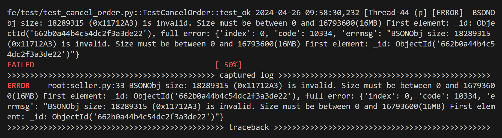
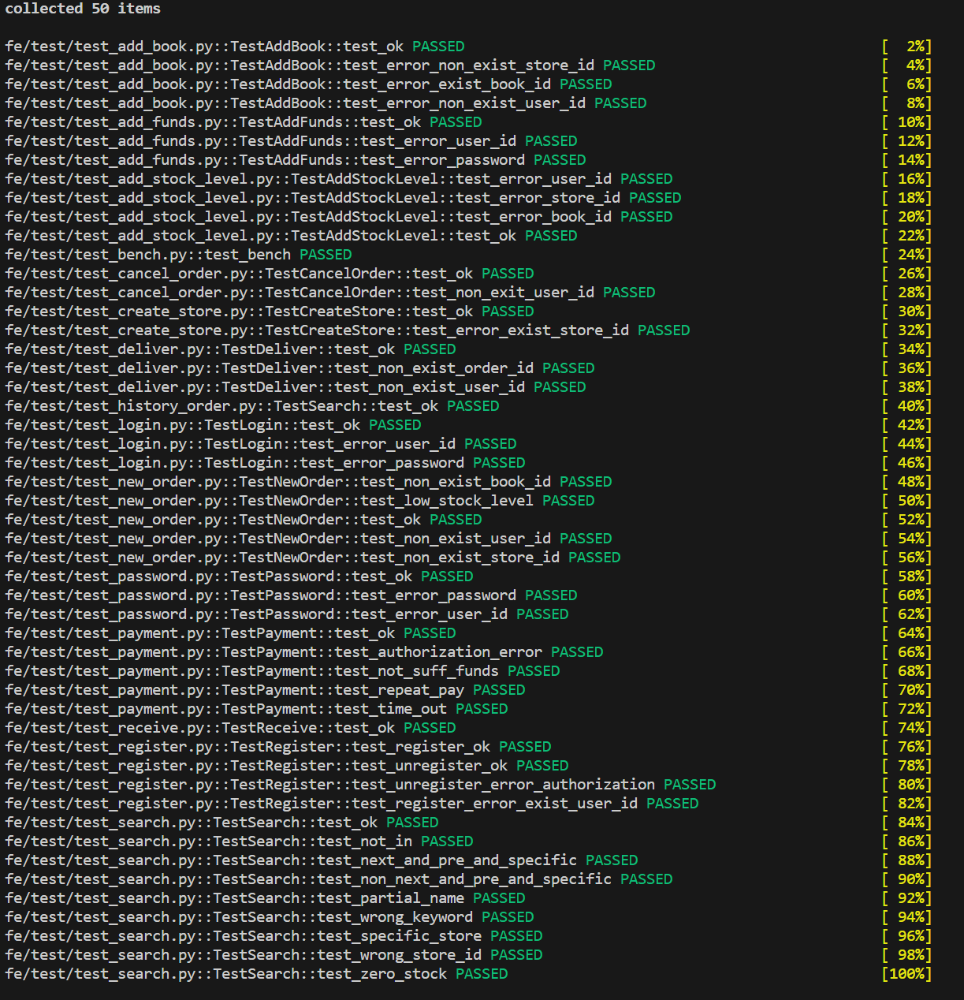
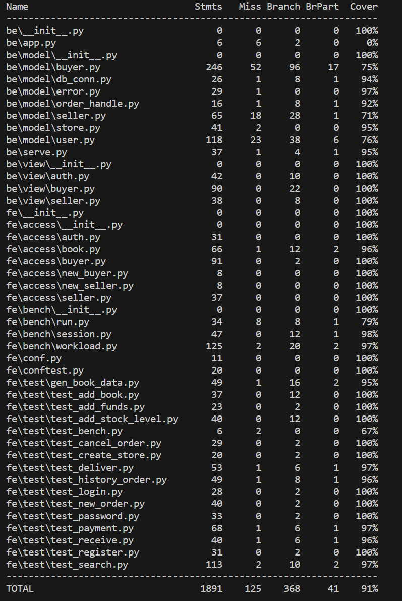
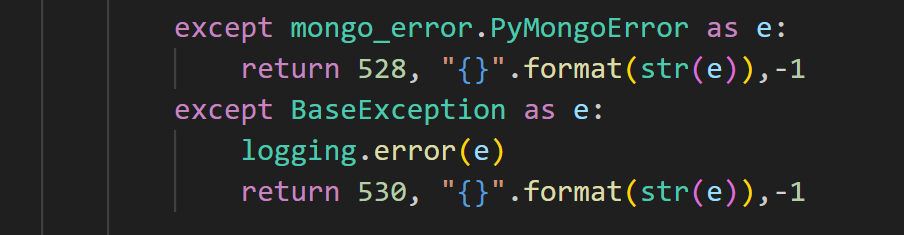
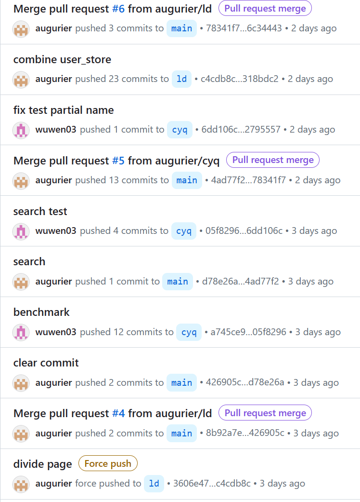
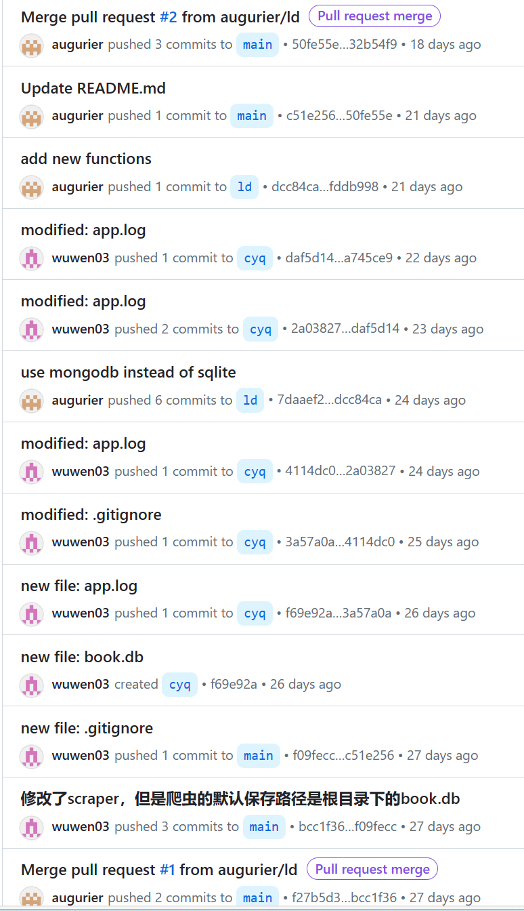

# 实验报告

## 1. 开发流程

由于对于sql语言更加的熟悉，所以开发流程选择了先试用sqlite将具体的功能全部实现并且调试通过。然后将sql语句替换成MongoDB的指令。最后根据文档数据库的特性进行迭代开发。

## 2. 书本本地存储

从网盘获取大数据集后，我们使用`cut_book_lx.py`从中截取了前十五条作为小数据集测试。
`save.py`, `save_lx.py`则分别存储大小数据集到本地mongodb。（这部分代码都存放在fe/data下）

## 3. 文档数据库设计

### 3.1 总体框架
首先展示我们最终采用的文档数据库schema设计：

```
user{
user_id
password
balance
token
terminal
bids []
}

store{
store_id
user_id
books[{book_id, stock_level}]
}

new_order{
order_id
user_id
store_id
status
order_datetime
}

new_order_detail{
order_id
book_id
count
price
}

his_order{
order_id
user_id
store_id
status
order_datetime
}

his_order_detail{
order_id
book_id
count
price
}

book{
    id
    title
    author
    ...
    content
    tags
    pictures
}
```
相比原来sql版本的schema，我们做的最主要的改变是store表。

首先我们删除了user_store表，并将user作为一个字段放在store表中。这是因为因为一个store一定只被一个用户所有，但是一个用户可以拥有多个store，而查询两者关系时使用中间表有些多此一举。

其次我们将每个store的所有书信息合并为一个数组books存放。这也是源于文档数据库的数组文档特点，不用像关系数据库一样不得不将每条关系单独存放。但是由于mongodb的存储限制，最终放弃了在数组中增加book_info字段，改为根据book_id在book集合中查询。考虑到实际中用户想要阅览商店书籍的相信信息往往也要额外的跳转，而book_id上也有着主键索引，这样的改动并无太大影响。

其它方面设计也略有修改，其中订单相关设计详见`4.1` `4.2`，user表新增bids字段的原因详见`4.3`。

### 3.2 索引设计

文档数据库中的索引对于查找多，修改少的字段有较好的优化作用。此外各集合中包含id的字段也有其唯一性。经过权衡，我们最终选择了与sqlite版本主键相类似的索引设计：
```python
col_user.create_index([("user_id", 1)], unique=True)
col_store.create_index([("store_id", 1)], unique=True) #由于上述原因，删去了原本有book_id的复合索引
col_new_order.create_index([("order_id", 1)], unique=True)
col_new_order_detail.create_index([("order_id", 1), ("book_id", 1)], unique=True)
col_his_order.create_index([("order_id", 1)], unique=True)
col_his_order_detail.create_index([("order_id", 1), ("book_id", 1)], unique=True)
col_book.create_index([("id", 1)], unique=True)
```

## 4. 新功能添加

在这一部分，我们将按照需要实现的功能来描述实现的细节。对于功能划分以便于阐述为主，可能和文档里面的要求的顺序不同。

### 4.1 实现发货收货等后续过程、订单状态、取消订单

为了实现这个功能，首先需要将所有的订单附上有关订单状态的信息。同时，为了实现订单取消的功能，在每一个订单上面还要记录下单时间的信息。前者是 `state`，后者是 `datetime`。所有订单可能的状态信息如下所示：

```
wait for payment
wait for delivery
delivering
received
cancelled
```

通过这些字段，可以表明一个订单从下单到运送到买者手中或是因为主动或超时而取消的状态。在下单完成后，订单状态变为 `wait for payment`；当付款完毕后，订单状态变为 `wait for delivery`；当卖家发货后，订单状态变为 `delivering`；当买家收货后，订单状态变为 `received`；当用户在付款的时候将当前时间和下单时间进行比较，在超过一定时间未付款的时候取消订单，订单状态变为 `cancelled`；在用户主动取消订单的时候，订单状态也变为 `cancelled `。

具体的代码分散在各处，因此这里仅展示新建订单时候的部分内容：
```python
cur_time = str(int(time.time())) #纪元以来的秒数
order1 = {
            'order_id' : uid,
            'store_id' : store_id,
            'user_id' : user_id,
            'state' : 'wait for payment',
            'order_datetime' : cur_time
        }
col_new_order.insert_one(order1)
```
对于有关订单状态的函数展示如下：
```python
def set_order_state(col_order, order_id, new_state, old_state = 'any'): 
    target = {'order_id': order_id}
    if old_state != 'any':
        target['state'] = old_state   
              
    rows = col_order.update_one(target, {'$set': {'state': new_state}})
    
    if rows.matched_count != 1:
        return False
    else:
        return True
```

### 4.2 历史订单查询

为了实现历史订单查询的功能，一开始有两个方案：

1. 在订单中附加一个字段，表明是否是历史订单还是新的订单
2. 单独创建一个和 `new_order new_order_detail`相同schema的数据库存放历史订单数据

经过讨论我们采用了第二种实现方式，具体考量如下：

1. 如果新的订单和历史订单全部存放在相同的数据库中，那么经过了一段时间的使用，数据库将变得十分的庞大。因此在付款的时候需要检索新的订单的时候的性能将随着时间而降低。这对于用户付款时候的体验是十分不好的。（~~从某种角度来说，或许用户付完款之后的使用体验并没有付款时候的付款体验重要~~）。使用两个数据库进行管理可以尽可能的提高新订单的相关操作。
2. 从数据冷热程度的视角进行考察，新订单的有关数据是显著热于历史订单的。用户大多在请求订单后就立即进行付款操作。而对于历史订单，特别是很久之前的订单，则可能根本不会访问。如果将这两类数据进行分离，就更有利于进行冷热数据的差异化管理，具体来说可以体现在热数据的预取操作、不同类型的数据存放在存储层次结构中的不同位置等方面。

这里将订单数据迁移部分抽象成了函数（同时适用于 `history_order -> new_order` 和 `history_order_detail -> new_order_detail`）展示如下：
```python
#order or detail
def new_to_his(col_new, col_his, order_id):
    rows = col_new.find({'order_id': order_id}, {'_id': 0})
    for row in rows:
        col_his.insert_one(row)
    rows = col_new.delete_many({'order_id': order_id})
        
    if rows.deleted_count == 0:
        return False
    else:
        return True
```

在查询历史订单的时候，我们使用多表连接的方式进行查询：虽然MongoDB在实现多表连接（`lookup`）时，会将新表文档合并成一个数组，且多次连接筛选需运用管道操作，十分复杂，但本质上的查询方式和sql基本等价。这里展示了两个版本的实现：
```python           
            match1 = {'$match': {'user_id': user_id}}
            look_up1 = {'$lookup': {'from': 'his_order_detail', 
                                   'localField': 'order_id', 
                                   'foreignField': 'order_id', 
                                   'as': 'order_detail'}} 
            look_up2 = {'$lookup':{'from': 'store',
                                   'localField': 'store_id',
                                   'foreignField': 'store_id',
                                   'as': 'store_item'}}
            project = {'$project': {'_id': 0, 'order_id': 1, 'store_id': 1, 'state': 1, 'order_datetime': 1,
                                    'book_id': '$order_detail.book_id', 'count': '$order_detail.count', 'price': '$order_detail.price',
                                    'difference': {'$in': ['$order_detail.book_id', '$store_item.books.book_id']}}}
            match2 = {'$match': {'difference': True}}
            rows = col_his_order.aggregate([match1, look_up1, look_up2, project, match2])          
            # sql="""
            #     select A.order_id,A.store_id,state,order_datetime,B.book_id,count,price 
            #     from history_order as A 
            #     join history_order_detail as B on A.order_id=B.order_id
            #     join store as C on A.store_id=C.store_id and B.book_id=C.book_id
            #     where user_id='{}'""".format(user_id)
```

### 4.3 搜索图书

对于搜索图书，我们采用了分页设计，同时设计了两步查询的查询逻辑：

1. 需要查询的时候，前端调用`search`发送查询的关键词和查询内容。关键词部分由前端负责做成正则表达式的形式。后端将关键词和查询内容送入书籍信息数据库进行匹配，将结果存入用户数据库`user`表相应用户的`bids`字段。完成后向前端返回查询一共得到多少页的内容。
2. 前端根据返回的页数，再向后端发送具体的查询请求。具体查询请求包括三种，分别是：`next_page pre_page specific_page`。根据名字可以知道前两者完成的是前后翻页；最后一个完成的是特定页的访问，符合大部分用户习惯。后端根据上一次search得到的bids的数据，进行具体的查询。

设计的出发点如下：
1. 由于请求的搜索范围可能很大，所以搜索的结果也可能很大。如果一次性将所有的查询得到的数据信息全部传给前端，那么传输的消耗就非常的大。所以需要进行分页操作进行查询。
2. 我们认为，即使只传输查询得到的`bids`，一方面来说，查询得到的可能得bids也非常的多，传输消耗也是相当可观；另一方面来说，前端需要根据`bids`发送具体的查询请求，这样子相当于`bids`被反复的发送，我们认为这是没有必要的。所以选择将`bids`存放在数据库中。
3. 如果使用数据库自带的`limit` `skip`有关的指令，我们查看文档发现这个底层的实现原理是一个个计数过去，而且文档本身也不推荐使用这种方式进行分页操作，所以我们希望将第一步查询得到的结果存放进数据库中，供第二步具体查询阶段使用，以实现高效的分页查询。

实现代码如下：
```python
def get_book_from_bid(self, user_id: str, have_pic: bool) -> tuple[list[dict]]:
        res = []
        # have_pic=False
        if have_pic:
            content = {'_id': 0}
        else:
            content = {'_id': 0, 'picture': 0}
        
        col_user = self.database["user"]
        row = col_user.find_one({'user_id': user_id}, {'bids': 1})   
        bids = row["bids"] 
        
        col_book = self.col_book
        rows = col_book.find({'id': {'$in': bids}}, content)
        res = [row for row in rows]  
        if have_pic:
            for row in res:
                row['picture']=str(row['picture'])
        return res

def next_page(self, user_id: str, page_now: int, pages: int, have_pic: bool) -> tuple[int, str, list[dict], int]:
    next_page = page_now + 1
    if next_page > pages:
        return error.error_non_exist_page(next_page)+([],page_now,)
    
    bids = self.get_book_from_bid(user_id, have_pic)
    res = bids[next_page * SEARCH_PAGE_LENGTH: (next_page+1) * SEARCH_PAGE_LENGTH:]
    return 200,"ok",res,next_page

def pre_page(self, user_id: str, page_now: int, have_pic: bool) -> tuple[int, str, list[dict], int]:
    pre_page = page_now - 1
    if pre_page < 0:
        return error.error_non_exist_page(pre_page)+([],page_now,)
    
    bids = self.get_book_from_bid(user_id, have_pic)
    res = bids[pre_page * SEARCH_PAGE_LENGTH: (pre_page+1) * SEARCH_PAGE_LENGTH:]
    return 200,"ok",res,pre_page

def specific_page(self, user_id: str, page_now: int, target_page: int, pages: int, have_pic: bool) -> tuple[int, str, list[dict], int]:
    if target_page > pages or target_page < 0:
        return error.error_non_exist_page(target_page)+([],page_now,)
    
    bids = self.get_book_from_bid(user_id, have_pic)
    res = bids[target_page * SEARCH_PAGE_LENGTH: (target_page+1) * SEARCH_PAGE_LENGTH:]
    return 200,"ok",res,target_page
```

## 5. 测试结果


考虑到每个函数下面都有四五行调试产生的except无需覆盖，我们的测试样例已实际覆盖了几乎所有的分支。


## 6. 问题总结

### 6.1 注释问题

或许是因为我们两人的本地中文编码格式冲突，随着开发的进行，仓库中的中文注释渐渐都变成了乱码。这也提醒了我们，以后除非确认环境一致正确，写代码时还是尽量使用英文的注释。

### 6.2 设计与实现问题

小部分功能（比如分页）在实现前没有讨论清楚所有细节，导致实现时经过了多次反复的修改。每一次修改又要经历从测试到前端到后端多个文件的处理，造成了一些不必要的时间效率浪费。当然这一问题无法完全避免，但这也提醒我们日后要更多关注这一问题。

## 7. 版本管理与分工

### 7.1 git版本控制
我们的github仓库地址是 https://github.com/augurier/book_store 
每位组员拥有自己的branch，便于开发的并发完成（比如前60%功能从sql到mongodb的转换，与后40%功能的实现就是同步进行），大部分代码也是在自己的分支上完成后merge到主分支

### 7.2 分工

陈胤遒：实现后40%功能的sqlite版本，包括关系数据库设计；编写测试样例；效率测试；实验报告撰写。

李度：实现全部功能的sqlite转mongodb, 包括文档数据库设计；优化搜索分页功能；数据集处理；实验报告撰写。