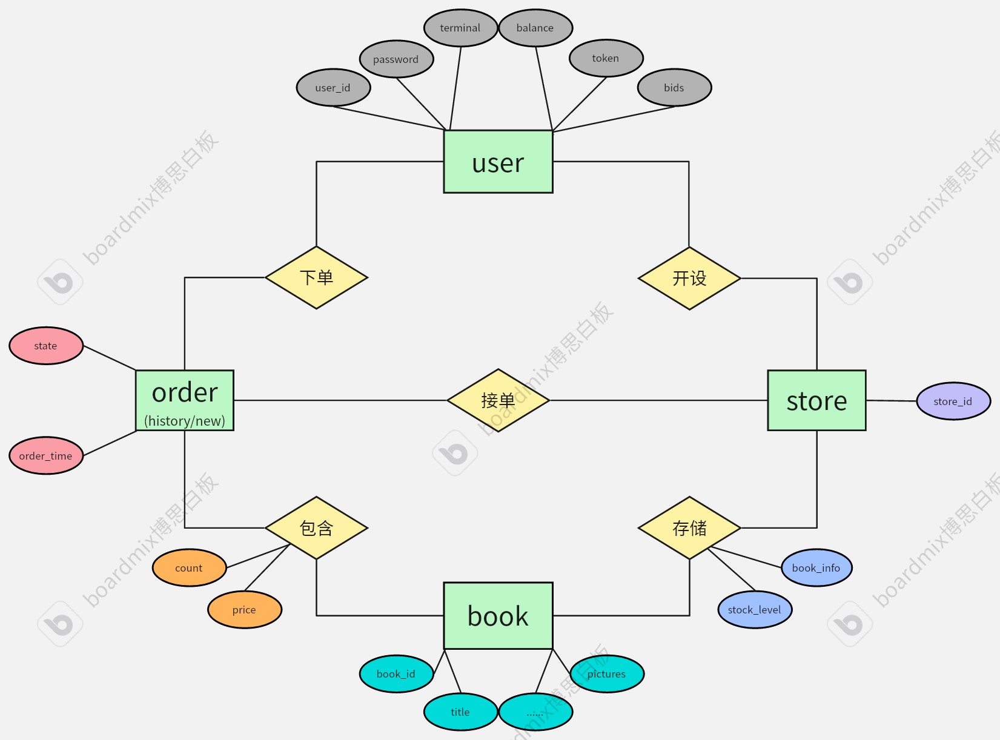
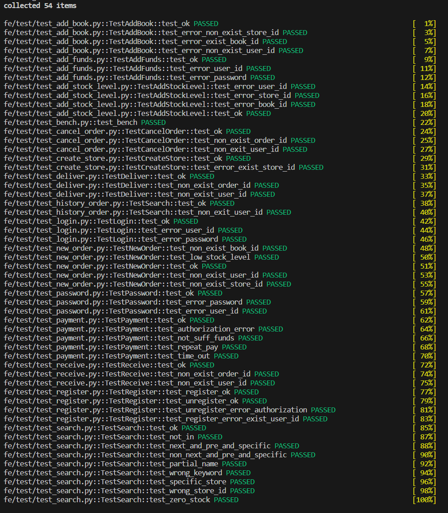
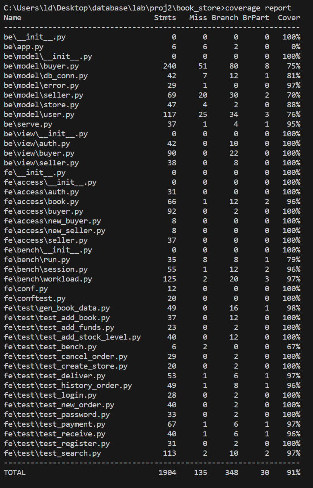
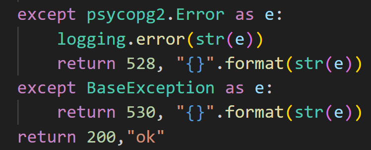
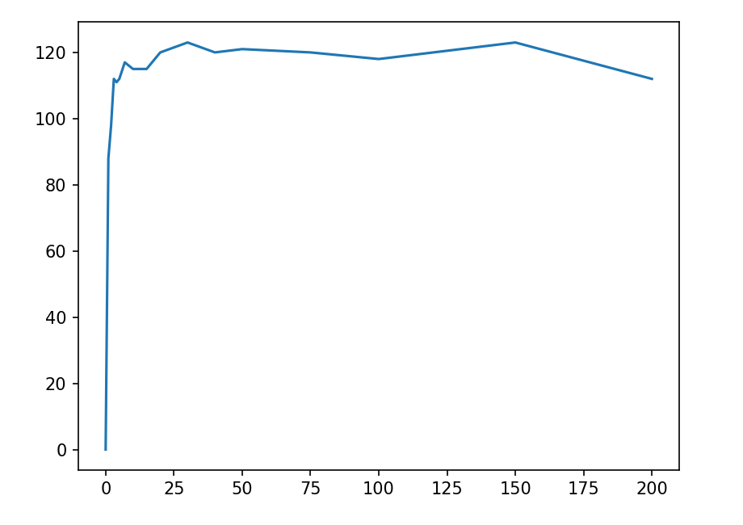
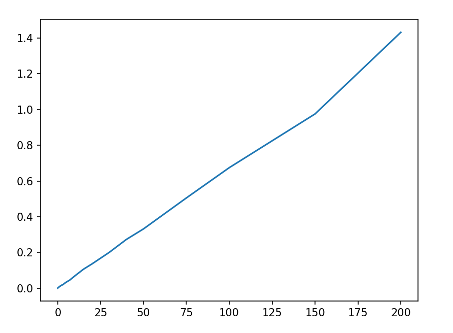

# 实验报告
## 1. 开发流程
在pj1的开发过程中，曾经有一个版本是在sqlite数据库下实现了大部分功能。因此这次先使用了版本回退找到了该版本，在此基础上补全了新开发的功能，调整数据库设计，转移数据库至postgresql并进行进一步的开发。  

## 2. 数据库设计
### 2.1 ER图

### 2.2 各表信息与设计思路
相比使用灵活的文档数据库，关系数据库被限制成一条条关系组成的表格，并失去了嵌套的能力。但于此同时带来的优势则是，表与表之间的关系更加清晰。
```user_```
| 属性 | 类型 | 键 |
| ---  | --- | ---|
|user_id|text|主键
|password|text
|balance|int
|token|text
|terminal|text
|bids|text

```user_store```
| 属性 | 类型 | 键 |
| ---  | --- | ---|
|user_id|text|外键: user(user_id)
|store_id|text|主键

```store```
| 属性 | 类型 | 键 |
| ---  | --- | ---|
|store_id|text|外键：user_store(store_id), 与book_id联合主键
|book_id|text|与store_id联合主键
|book_info|text
|stock_level|text  

对于user和store间的关系，在文档数据库中由于可以把store的所有书合成一个列表放在一个文档中，store_id可以作为store的主索引，使两表间的文档实际上一一对应，不再需要额外的user_store表，而是将user作为store的一个字段。而在关系数据库中，一条条关系的限制决定了store和book_id只能作为联合索引，user和store间保持一对多关系。这样使用user_store表用作连接查询就显得必要且有意义了。

总结一下三表的关系：用户注册时将信息插入到user表，已注册的用户（user_id外键限制）开商店时将商店id插入user_store表，已登记的商店（store_id外键限制）加书时将信息插入store表中。  

user_表新加入bids字段在查询时使用。（理由可见pj1 4.3部分）  

```new_order```
| 属性 | 类型 | 键 |
| ---  | --- | ---|
|order_id|text|主键
|user_id|text|外键: user(user_id)
|store_id|text|外键：user_store(store_id)
|state|text
|order_datetime|text

```new_order_detail```
| 属性 | 类型 | 键 |
| ---  | --- | ---|
|order_id|text|外键: new_order(order_id), 与book_id联合主键
|book_id|text|与order_id联合主键
|count|int
|price|int

```history_order```
| 属性 | 类型 | 键 |
| ---  | --- | ---|
|order_id|text|主键
|user_id|text|外键: user(user_id)
|store_id|text|外键：user_store(store_id)
|state|text
|order_datetime|text

```history_order_detail```
| 属性 | 类型 | 键 |
| ---  | --- | ---|
|order_id|text|外键: history_order(order_id), 与book_id联合主键
|book_id|text|与order_id联合主键
|count|int
|price|int

关于四张订单表的设计和文档数据库中差别不大，只是加了order_id外键限制增强两表间的联系。原因主要是冷热数据分离，差异化管理，以增强性能。这在pj1的报告中有详细说明（4.2部分），这里不再赘述。

```book```**(nosql)**
```
book{
    id
    title
    author
    ...
    content
    tags
    pictures
}
```

虽然实验要求中说可以将blob数据分离存储，但在实际实现中最终选择将所有书本信息仍旧存储在mongodb中。这主要是出于以下考量：  
1. 如果将小属性存sql而大属性存nosql，那么如果要得到一本书的所有信息则要查询两个数据库，增加不必要的开销。
2. 如果将小属性存sql而所有属性另存一份在nosql，根据不同需求查询不同的数据库，那么sql中的数据实际都是冗余，不如也直接通过nosql查询小属性。
3. 书本的信息一经存储基本不会再修改，更多是作为被查询信息。因此关系数据库的一大优势——事务支持也用不太到。
综上，选择仍然使用nosql存储书本信息。book_id作为关联使用的约定外键。在实现过程中同样将书本信息存储在sql中进行尝试比较，存储代码文件为bookstore/fe/data/save_psql.py。  

## 3. 新功能实现
### 3.1 收货发货、取消订单
通过订单的state字段，可以表明一个订单从下单到运送到买者手中或是因为主动或超时而取消的状态。在下单完成后，订单状态变为 `wait for payment`；当付款完毕后，订单状态变为 `wait for delivery`；当卖家发货后，订单状态变为 `delivering`；当买家收货后，订单状态变为 `received`；当用户在付款的时候将当前时间和下单时间进行比较（`order_datetime`字段），在超过一定时间未付款的时候取消订单，订单状态变为 `cancelled`；在用户主动取消订单的时候，订单状态也变为 `cancelled `。每一次状态的变化合并成一次事务的提交，这样防止了订单状态的异常，充分发挥了事务的ACID四个特性。  
具体代码较多，这里仅展示收货代码作为例子：  
```python
    def receive(self, user_id: str, order_id: str) -> tuple[(int,str)]:
        conn = self.conn
        try:
            if not self.user_id_exist(user_id):
                return error.error_non_exist_user_id(user_id)

            conn.execute(
                "UPDATE history_order SET state='received' "
                "WHERE user_id=%s AND order_id=%s AND state='delivering'",
                (user_id,order_id)
            )

            self.con.commit()
        except psycopg2.Error as e:
            return 528, "{}".format(str(e))
        except BaseException as e:
            return 530, "{}".format(str(e))
        return 200,"ok"
```

### 3.2 历史订单查询
在查询历史订单的时候，我们使用多表连接的方式进行查询：MongoDB在实现多表连接（`lookup`）时，会将新表文档合并成一个数组，且多次连接筛选需运用管道操作，十分复杂，但本质上的查询方式和sql基本等价。在pj1的实现中也是先实现了sql版本再进行替换。从这里也不难发现，当业务涉及到多表关系时，文档数据库形式灵活的优点在实现难度上反而成了劣势，而关系数据库形式虽在一开始就受关系限制，却在此时能用更简洁的sql语言实现查询。  
这里再次展示两个版本的代码供比较异同：  
```python           
            # match1 = {'$match': {'user_id': user_id}}
            # look_up1 = {'$lookup': {'from': 'his_order_detail', 
            #                        'localField': 'order_id', 
            #                        'foreignField': 'order_id', 
            #                        'as': 'order_detail'}} 
            # look_up2 = {'$lookup':{'from': 'store',
            #                        'localField': 'store_id',
            #                        'foreignField': 'store_id',
            #                        'as': 'store_item'}}
            # project = {'$project': {'_id': 0, 'order_id': 1, 'store_id': 1, 'state': 1, 'order_datetime': 1,
            #                         'book_id': '$order_detail.book_id', 'count': '$order_detail.count', 'price': '$order_detail.price',
            #                         'difference': {'$in': ['$order_detail.book_id', '$store_item.books.book_id']}}}
            # match2 = {'$match': {'difference': True}}
            # rows = col_his_order.aggregate([match1, look_up1, look_up2, project, match2])          
            sql="""
                select A.order_id,A.store_id,state,order_datetime,B.book_id,count,price 
                from history_order as A 
                join history_order_detail as B on A.order_id=B.order_id
                join store as C on A.store_id=C.store_id and B.book_id=C.book_id
                where user_id='{}'""".format(user_id)
            conn.execute(sql)
            res = conn.fetchall()     
            self.con.commit()
```

### 3.3 搜索图书
对于搜索图书，采用了分页设计，同时基于性能和业务需求的考量（具体见pj1 4.3部分），设计了两步查询的查询逻辑。而由于这里独特的sql和nosql结合的数据库设计，在具体实现时也将两种语言相结合：需要书本具体信息进行模糊查询时采用nosql，得到查询结果book_id时存入user_表，以便后续分页操作。（这里的细节处理是，把原本数组形式的book_id用逗号分隔合成字符串，以便存入关系数据库。）  
具体实现如下：  
```python
    def search(self,user_id:str,keyword:str,content:str,store_id:str) -> tuple[(int,str,int)]:
        conn = self.conn
        try:
            self.conn.execute(
                "UPDATE user_ SET bids = %s WHERE user_id = %s",
                ('', user_id),
            )
            self.con.commit()
            
            keys = self.col_book.find_one().keys()
            if keyword not in keys or keyword == '_id':
                return error.error_wrong_keyword(keyword)+(-1,)
            
            sql = """select distinct book_id from store """
            if not store_id == "":
                sql += " where store_id='{}'".format(store_id)
                if not self.store_id_exist(store_id):
                    return error.error_non_exist_store_id(store_id)+(-1,)
            conn.execute(sql)
            row = conn.fetchall()
            if row == []:
                return 200,"ok",0
            bids = list(map(lambda x:x[0],row))
            # bids:tuple[str,]=tuple(map(lambda x:x[0],row))
            # if len(bids) == 1 :
            #     bids="('"+str(bids[0])+"')"
            rows = self.col_book.find({'id': {'$in': bids}, keyword: {'$regex':  content}}, 
                               {'_id': 0, 'id': 1})
            res = list(map(lambda x:x['id'],rows)) 
            # search_sql="""select id from {} 
            #     where id in {} and {} like '%{}%'""".format(book_tb,bids,keyword,content)
            # conn.execute(search_sql)
            # row = conn.fetchall()
            # if row == []:
            #     return 200,"ok",0
            # res = list(map(lambda x:x[0],row))
            bids = ','.join(res)
            conn.execute(
                "UPDATE user_ SET bids = %s WHERE user_id = %s",
                (bids, user_id),
            )
            self.con.commit()
            pages = len(res) // SEARCH_PAGE_LENGTH #结果共几页
        except psycopg2.Error as e:
            logging.error(e)
            return 528, "{}".format(str(e)),-1
        except mongo_error.PyMongoError as e:
            logging.error(e)
            return 529, "{}".format(str(e)),-1
        except BaseException as e:
            logging.error(e)
            return 530, "{}".format(str(e)),-1
        return 200,"ok",pages
```
后续分页的接口不涉及数据库操作，复用了pj1部分，这里也不再展示。这也体现了代码接口具有良好的隔离性。

## 4. 测试结果
### 4.1 覆盖率测试
测试样例方面复用了pj1时编写的样例并进行了略微补充，但发现在pj1的报告中没有进行充分介绍，这里对新加的样例接口进行补充介绍。  
**test_cancel_order**
test_ok: 测试正常取消订单  
test_non_exist_order_id：测试取消订单号不存在的订单 
test_non_exit_user_id：测试取消下单人不存在的订单  

**test_deliver**
test_ok: 测试正常发货  
test_non_exist_order_id：测试发货订单号不存在的订单  
test_non_exit_user_id：测试发货下单人不存在的订单  

**test_payment**
test_ok: 测试正常充值、支付  
test_authorization_error：测试密码错误导致的登录支付失败  
test_not_suff_funds：测试存款不足导致的支付失败  
test_repeat_pay：测试重复下单
test_time_out：测试订单超时

**test_receive**
test_ok: 测试充值、支付、发货收货正常
test_non_exist_order_id：测试收到订单号不存在的订单  
test_non_exit_user_id：测试收到下单人不存在的订单  

**test_history_order**
test_ok: 测试正常查询到用户所有的历史订单
test_non_exit_user_id：测试查询不存在的用户的历史订单  

**test_search**
test_ok: 测试正常根据标题查询书名，得到正确的id  
test_not_in: 测试查询书名不存在的书，正常返回但无结果id  
test_next_and_pre_and_specific: 测试一次正常查询到多本书，尝试前、后、特定翻页  
test_non_next_and_pre_and_specific：测试前、后、特定翻到不存在的页，导致失败  
test_partial_name: 测试截取部分书名进行模糊查询  
test_wrong_keyword: 测试根据不存在的字段进行查询，导致失败
test_specific_store: 以上都是全商店搜索，这里测试将书放入一家店，而在另一家店搜索该书，得到不存在的结果
test_wrong_store_id: 测试在不存在的商店搜索
test_zero_stock: 测试在没有书的商店搜索，正常返回但无结果id  

测试结果如下：  


考虑到每个函数有至少四五行调试代码，测试样例基本能覆盖所有分支。  


### 4.2 性能测试
这里同样复用了pj1中调试改进的代码（解决了假并发、吞吐率正比上升且无上限的bug）  
测试环境: Intel(R) Core(TM) i9-14900HX 24核32线程 16GB内存
结果如下: 
吞吐率： 

下单延迟：


在开始时提高并发数量会得到吞吐率的提升；但是到一定程度负载饱和，吞吐量趋于稳定。此外这次额外绘制了下单延迟的结果，可以看到延迟随着并发线程数增加不断增加，符合预期。

## 5. 问题总结
1. 最初实现的代码没有捕捉到部分错误，导致调试时捕捉到下一次事务错误中断，难以判断前一次的错误究竟在哪里，只能依靠缩小范围排查的方法确定问题，影响了效率。  
2. 增加外键时，没有注意到表和数据的删除必须依赖外键顺序，加上一的原因调试了许久，最终直接在psql终端查看表时才发现问题。

## 6. 版本控制
这里主要操作是pj1的版本回退和进一步开发。由于这次的项目实现过程主要是单人的，阶段实现的代码简单存放在了本地暂存区，全部完成后一并推送到了仓库。仓库地址是 https://github.com/augurier/book_store，保存了两个版本的分支 。
